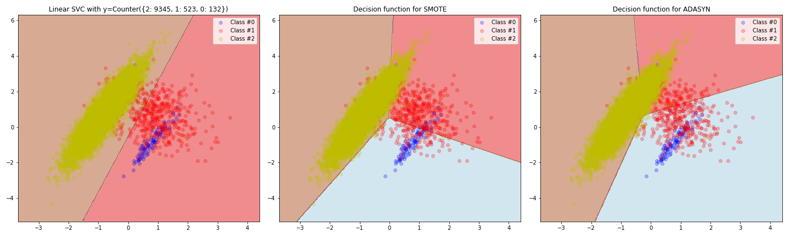
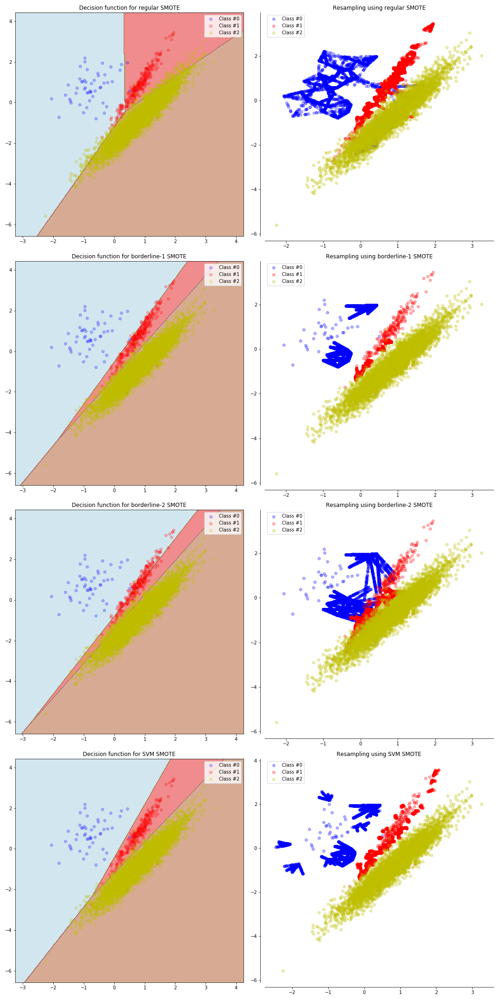

.. _over-sampling:

=============
Over-sampling
=============

.. currentmodule:: imblearn.over_sampling

A practical guide
=================

The learning phase and the subsequent prediction of machine learning algorithms
can be affected by the problem of imbalanced data set. The balancing issue
corresponds to the difference of the number of samples in the different
classes. We illustrate the effect of training a linear SVM classifier with
different level of class balancing.

.. image:: ./modules/balancing_problem/linear_svc_imbalanced_issue.png
   :scale: 80
   :align: center

As expected, the decision function of the linear SVM is highly impacted. With a
greater imbalanced ratio, the decision function favor the class with the larger
number of samples, usually referred as the majority class.

Naive random over-sampling
--------------------------

One way to fight this issue is to generate new samples in the classes which are
under-represented. The most naive strategy is to generate new samples by
randomly sampling with replacement the current available samples. The
:class:`RandomOverSampler` offers such scheme::

   >>> from sklearn.datasets import make_classification
   >>> X, y = make_classification(n_samples=5000, n_features=2, n_informative=2,
   ...                            n_redundant=0, n_repeated=0, n_classes=3,
   ...                            n_clusters_per_class=1,
   ...                            weights=[0.01, 0.05, 0.94],
   ...                            class_sep=0.8, random_state=0)
   >>> from imblearn.over_sampling import RandomOverSampler
   >>> rus = RandomOverSampler(random_state=0)
   >>> X_resampled, y_resampled = rus.fit_sample(X, y)
   >>> from collections import Counter
   >>> print(Counter(y_resampled))
   Counter({2: 4674, 1: 4674, 0: 4674})

The augmented data set should be used instead of the original data set to train
a classifier::

  >>> from sklearn.svm import LinearSVC
  >>> clf = LinearSVC()
  >>> clf.fit(X_resampled, y_resampled) # doctest: +ELLIPSIS
  LinearSVC(...)

In the figure below, we compare the decision functions of a classifier trained
using the over-sampled data set and the original data set.

As a result, the majority class does not take over the other classes during the
training process. Consequently, all classes are represented by the decision
function.

From random over-sampling to SMOTE and ADASYN
---------------------------------------------

Apart from the random sampling with replacement, there is two popular methods
to over-sample minority classes: (i) Synthetic Minority Oversampling Technique
(SMOTE) and (ii) Adaptive Synthetic (ADASYN) sampling method. These algorithm
can be used in the same manner::

  >>> from imblearn.over_sampling import SMOTE, ADASYN
  >>> X_resampled, y_resampled = SMOTE().fit_sample(X, y)
  >>> print(Counter(y_resampled))
  Counter({2: 4674, 1: 4674, 0: 4674})
  >>> clf_smote = LinearSVC().fit(X_resampled, y_resampled)
  >>> X_resampled, y_resampled = ADASYN().fit_sample(X, y)
  >>> print(Counter(y_resampled))
  Counter({2: 4674, 0: 4673, 1: 4662})
  >>> clf_adasyn = LinearSVC().fit(X_resampled, y_resampled)

The figure below illustrate the major difference of the different over-sampling
methods.

Ill-posed examples
------------------

While the :class:`RandomOverSampler` is over-sampling by repeating some of the
original samples, :class:`SMOTE` and :class:`ADASYN` generate new samples in by
interpolation. However, the samples used to interpolate/generate new synthetic
samples differ. In fact, :class:`ADASYN` focuses on generating samples next to
the original samples which are wrongly classified using a k-Nearest Neighbors
classifier while the basic implementation of :class:`SMOTE` will not make any
distinction between easy and hard samples to be classified using the nearest
neighbors rule. Therefore, the decision function found during training will be
different between the different algorithms.

The sampling particularities of these two algorithms can lead to some peculiar
behavior as shown below.

SMOTE variants
--------------

SMOTE might connect inliers and outliers while ADASYN might focus solely on
outliers which, in both cases, might lead to a sub-optimal decision
function. In this regard, SMOTE offers three additional options to generate
samples. Those methods focus on samples near of the border of the optimal
decision function and will generate samples in the opposite direction of the
nearest neighbors class. Those variants are presented in the figure below.

The parameter ``kind`` is controlling this feature and the following types are
available: (i) ``'borderline1'``, (ii) ``'borderline2'``, and (iii) ``'svm'``::

  >>> from imblearn.over_sampling import SMOTE, ADASYN
  >>> X_resampled, y_resampled = SMOTE(kind='borderline1').fit_sample(X, y)
  >>> print(Counter(y_resampled))
  Counter({2: 4674, 1: 4674, 0: 4674})

Mathematical formulation
========================

Both SMOTE and ADASYN use the same algorithm to generate new
samples. Considering a sample :math:`x_i`, a new sample :math:`x_{new}` will be
generated considering its k neareast-neighbors. For instance, the 3
nearest-neighbors are included in the blue circle as illustrated in the figure
below. Then, one of these nearest-neighbors :math:`x_{zi}` will be selected and
a sample will be generated as follows:

.. math::

   x_{new} = x_i + \lambda \times (x_{zi} - x_i)

where :math:`\lambda` is a random number in the range :math:`[0, 1]`. This
interpolation will create a sample on the line between :math:`x_{i}` and
:math:`x_{zi}` as illustrate on the figure below.

.. image:: ./modules/over_sampling/sample_generation.png
   :scale: 80
   :align: center

Each SMOTE variant and ADASYN differ from each other by selecting the samples
:math:`x_i` ahead of generating the new samples.

The **regular** SMOTE algorithm --- cf. to ``kind='regular'`` when
instantiating a :class:`SMOTE` object --- does not impose any rule and will
randomly pick-up all possible :math:`x_i` available.

The **borderline** SMOTE --- cf. to ``kind='borderline1'`` and
``kind='borderline2'`` when instantiating a :class:`SMOTE` object --- will
classify each sample :math:`x_i` to be (i) noise (i.e. all nearest-neighbors
are from a different class than the one of :math:`x_i`), (ii) in danger
(i.e. at least half of the nearest neighbors are from the same class than
:math:`x_i`, or (iii) safe (i.e. all nearest neighbors are from the same class
than :math:`x_i`). **Borderline-1** and **Borderline-2** SMOTE will use the
samples *in danger* to generate new samples. In **Borderline-1** SMOTE,
:math:`x_{zi}` will belong to a class different from the one of the sample
:math:`x_i`. On the contrary, **Borderline-2** SMOTE will consider
:math:`x_{zi}` which can be from any class.

**SVM** SMOTE --- cf. to ``kind='svm'`` when instantiating a :class:`SMOTE`
object --- uses an SVM classifier to find support vectors and generate samples
considering them.

ADASYN is working similarly to the regular SMOTE. However, the number of
samples generated for each :math:`x_i` is proportional to the number of samples
which are not from the same class than :math:`x_i` in a given
neighborhood. Therefore, more samples will be generated in the area that the
nearest neighbor rule is not respected.
